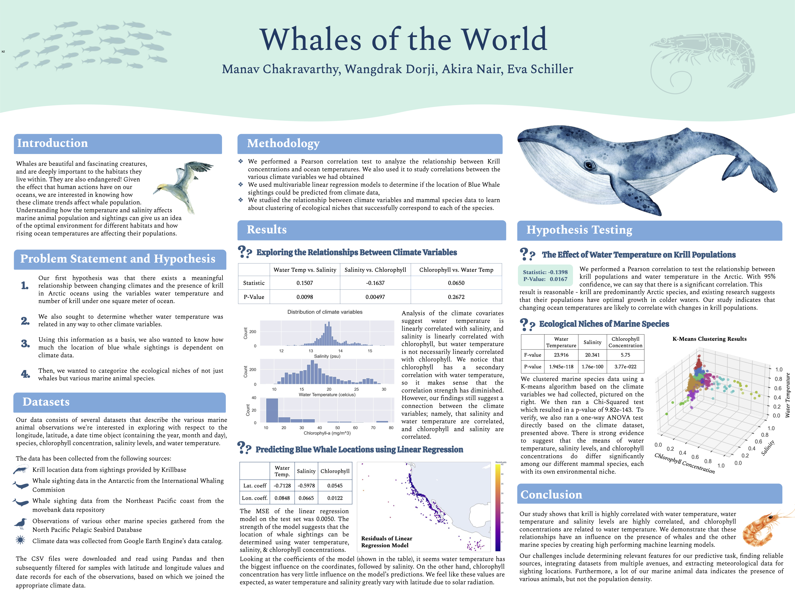

# 🐋 Whales of the World
Data Science Final Project 
### By Eva, Manav, Wangdrak, Akira

_Code and cleaned data redacted to preserve course privacy_

----
We have curated a database containing data on blue whales, marine animals, and krill populations, each joined via time and location with global climate data on ocean temperature, ocean salinity, and chlorophyll concentrations. 
Our blue whale is collected from [Argos Data](https://www.datarepository.movebank.org/handle/10255/move.838), while our marine animal data contains data from two sources: [OBIS-SEAMAP](https://www.frontiersin.org/articles/10.3389/fmars.2022.837604/full) and [US Geological Survey](https://www.usgs.gov/centers/alaska-science-center/science/north-pacific-pelagic-seabird-database). Both whale and marine animal data are based on opportunistic sightings, and all are located in the Eastern Pacific Ocean along the coast of the Western United States. Our krill data, collected from the [British Antarctic Survey](https://www.bas.ac.uk/project/krillbase/#data), is based on net sampling and is located in the Southern Ocean. In addition to the climate data listed above, it has been joined with yearly data from the [International Whaling Commission](https://iwc.int/management-and-conservation/whaling/total-catches) on total whales caught in the Antarctic region. Finally, all of our aforementioned ocean climate data is collected from Google Earth Engine’s [HYCOM](https://developers.google.com/earth-engine/datasets/catalog/HYCOM_sea_temp_salinity) data and [Ocean Color SMI data](https://developers.google.com/earth-engine/datasets/catalog/NASA_OCEANDATA_MODIS-Aqua_L3SMI#bands), and is joined based on date, longitude, and latitude  with every species’ data.
We have divided our database into three separate files, containing the data for whales, marine animals, and krill respectively. We chose to do so because the opportunistic nature of sightings makes it infeasible (and non-meaningful) to attempt to join different species’ data points across locations and time. However, each of the three datasets has been joined with all of our ocean climate data, and we aim to establish each of their relationships with these common variables.

[Link to download data.](https://drive.google.com/drive/folders/1FxsdX4tYQwt3AD46GZNvrNF0L5Z7d_pB?usp=share_link)

Samples of our data can be found in `data/processed/samples/`

----

#### Data Specs
> **TABLE OF CONTENTS**

> [Species](#species)

> [Krill Number](#krill-number-per-m2)

> [Marine Animals Lat-Lon](#marine-animals-latitude--longitude)

> [Whale Lat](#whale-latitude--longitude)

> [Date](#date)

> [Ocean Temperature](#ocean-temp)

> [Ocean Salinity](#ocean-salinity)

> [Phytoplankton Chlorophyll](#phytoplankton-chlorophyll)

##### Species
The species column is present in the `data/processed/clean_marine_animals_all.csv` dataset. It represents a 4 letter code indicating the species that the observation belongs to, stored as a string. There is no default value, and there are hundreds of species captured across the dataset most of which are not unique. At the moment, we don’t view this information as necessary for our analysis - it might be helpful in establishing trends with other variables such as the chlorophyll concentration or ocean temperature, but isn’t required. No sensitive information is captured. 
##### Krill number per m^2
The krill density is captured in the Southern Ocean, in between latitudes of -70° and -43°. The density (captured as the count per m^2), ranges from 0 to 1272, with a mean of 11. There aren’t any apparent trends in terms of its distribution, but we’re hoping to analyze trends in the density alongside changes in the ocean data variables. The values aren’t necessarily unique, and will be used to understand the impact of the ocean temperature and salinity levels. No sensitive information is captured. 
##### Marine Animals latitude & longitude
The latitude and longitude coordinates of the marine animals are stored in `data/processed/clean_marine_animals_all.csv`, corresponding to the location of each observation. They are stored as floats, with the longitude ranging from -168° to -83°, and the latitudes ranging from 3° to 55°. There doesn’t appear to be any trend within the distribution of the coordinates, and while the measurements are extremely precise (around 10 significant figures), they do not necessarily have to be unique. These values are required, as they correspond to the locations of the marine animals we’re interested in observing. In particular, we plan on using this information in conjunction with ocean data and whale coordinates to analyze presence/population trends. No sensitive information is captured within this column
##### Whale latitude & longitude
The latitude and longitude coordinates of the whales are stored in `data/processed/clean_blue_whales.csv`, corresponding to the location of each whale observation. They are stored as floats, with the longitude ranging from -165.6° to -87.5°, and the latitudes ranging from 5.5° to 52.9°. There doesn’t appear to be any trend within the distribution of the coordinates, and while the measurements are extremely precise (around 10 significant figures), they do not necessarily have to be unique. These values are required, as they correspond to the locations of the whales we’re interested in observing. In particular, we plan on using this information in conjunction with ocean data to predict the presence of whales, and understand what ocean data variables (ie salinity, temperature, chlorophyll concentrations) they’re correlated with. 
##### Date
All datasets– `data/processed/*.csv`,  have the attribute ‘date’, a string formatted as ‘YYYY-MM-DD’ which represents the date at which that data entry was observed/collected. For krill data, the ranges of years, months, and days are 2002 to 2016, 01 to 12, and 01 to 31, respectively. For blue whale data, the ranges are 2002 to 2009, 01 to 12, and 01 to 31, and for marine animal data, the ranges are 2002 to 2021, 01 to 12, and 01 to 31. The values are distributed approximately uniformly across days and years for all datasets. Across months, whales and marine animals have a generally uniform distribution while krill data was collected nearly exclusively in winter months. We use this attribute to join the appropriate climate data with population data, and will use it throughout our analysis to analyze change in other attributes over time. This is a required and non-unique value, and it captures no sensitive information. 
##### Ocean temp
Temperature below 2 m °C
Data type: Float
Min: -32.768*	
Max: 32.755*
The values are not necessarily unique, and we want to use this as a measure as a proxy for phytoplankton which in turn is a measure for whale presence.  This is a required value and we want to predict using temperature and salinity. Feature does not contain potentially sensitive information.
##### Ocean salinity
The ocean salinity at a depth of 2m ranges from -20.009 psu to 32.767 psu, captured as a float. There isn’t any intrinsic distribution to the data, although we’re hoping that there is a geographic distribution or a correlation with our ocean data variables. The values might be unique, but not necessarily so. This value will be used as a descriptor of ocean conditions, used to examine the presence of whales and other marine animals. It is a required value, as it serves as a basis for our analysis and prediction tools, and does not capture any sensitive information. 
##### Phytoplankton (chlorophyll)
Chlorophyll a concentration
Data type: Float
Min: 0.00
Max: 99.99
The values are not necessarily unique, and we want to use this as a measure as a proxy for phytoplankton which in turn is a measure for whale presence.  This is a required value and we want to predict using temperature and salinity. Feature does not contain potentially sensitive information.
